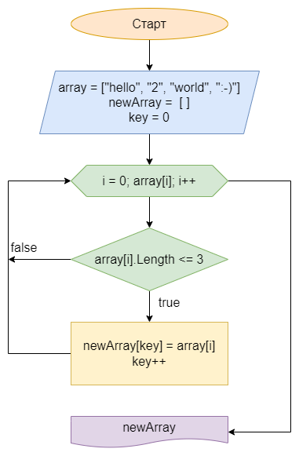

## **Итоговая проверочная работа**

- <details><summary>Задание</summary>

	1. Создать репозирорий на GitHub
	2. Нарисовать блок-схему алгоритма (можно основную содержательную часть, если в отдельном методе)
	3. Добавить описание решения (README.md)
	4. Написать программу
	5. Использовать контроль версий (п. 2, 3, 4 в разных коммитах)
	</details>

- <details><summary>Задача</summary>

	- Написать программу, которая из имеющегося массива строк формирует массив из строк, длина которых меньше либо равна 3 символа.
	- Первоначальный массив можно ввести с клавиатуры, либо задать на старте выполнения алгоритма.
	- При решении не рекомендуется пользоваться коллекциями, лучше обойтись исключительно массивами.
	- Примеры:
		```bash
		["hello", "2", "workd", ":-)"] -> ["2", ":-)"]
		["1234", "1567", "-2", "coputer sciense"] -> ["-2"]
		["Russia", "Denmark", "Kazan"] -> []
		```
    </details>

- <details><summary>Доп. инфо ℹ️</summary>

	*При написании программы была использована [часть ранее написанной библиотеки классов](https://github.com/crasher307/result-work/tree/master/func) (на базе [библиотеки](https://github.com/crasher307/c-sharp/tree/master/func) из репозитория "c-sharp")*
	### Запуск проекта
	```bash
						# 1. Запустить терминал (консоль), поддерживающий bash
	cd <projectPath>	# 2. Перейти в папку с проектом
	sh run.sh			# 3. Запустить проект
	```
	</details>

## **Описание логики**
<div style="font-size: 16px">

- запрашиваем ввод типа
	- **1**: тестовый массив
	- **2**: ввод массива с клавиатуры
- в зависимости от выбранного типа
	- **1**: заполняем стартовый массив тестовыми данными
	- **2**: запрашиваем ввод кол-ва эл-ов, заполняем стартовый массив (запрашиваем ввод на каждый элемент)
- вызываем функцию, возвращающую эл-ты попадающие под условие: `длина эл-та <= 3` (*логика в блок-схеме*)
	
- выводим стартовый массив
- выводим итоговый массив

</div>